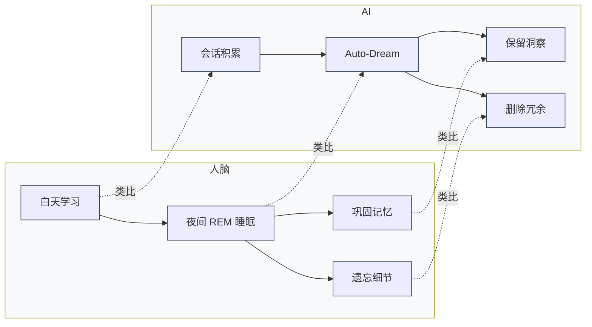
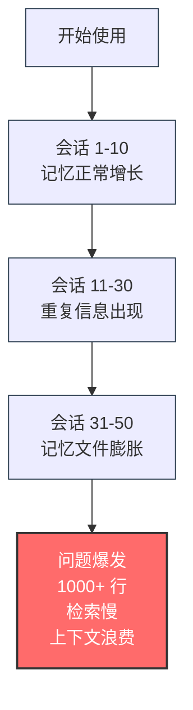
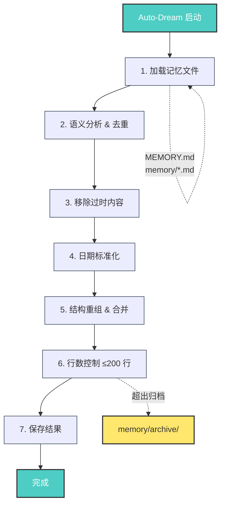
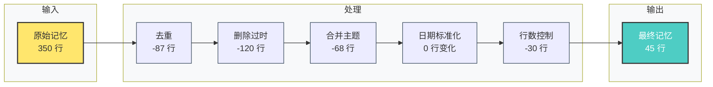
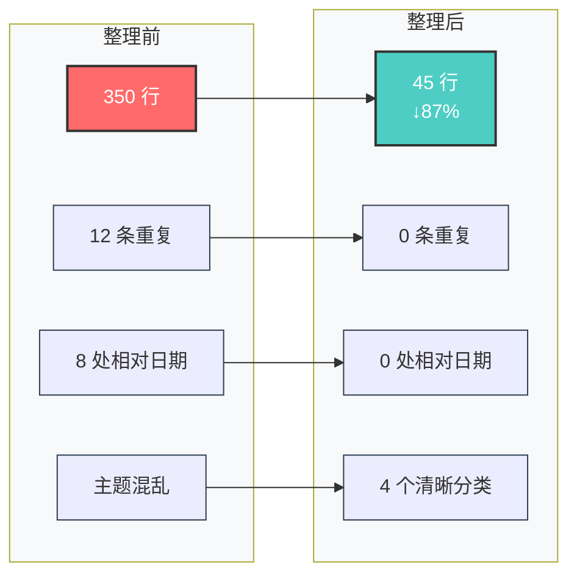
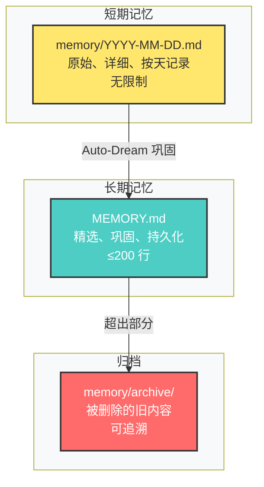
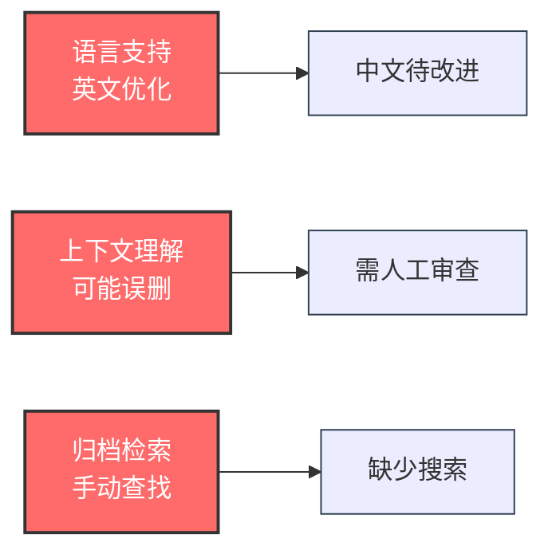
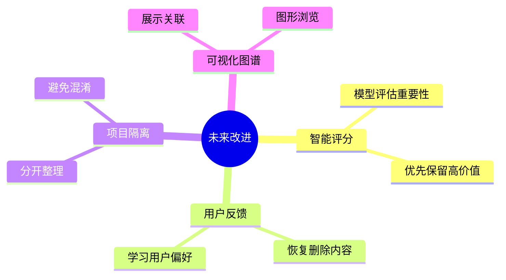
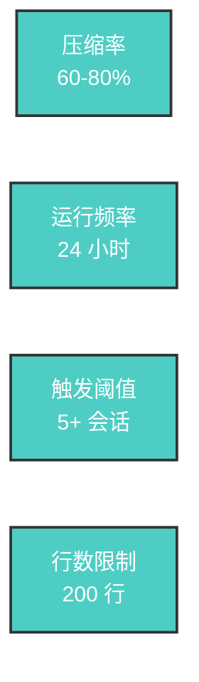

# Claude Code Auto-Dream：AI 智能体的"睡眠"记忆整理机制

> **摘要：** 深入解析 Claude Code 在 2026 年 3 月推出的 Auto-Dream 功能——一个后台子智能体如何模拟人类 REM 睡眠，自动整理、去重、巩固记忆文件，解决 AI 长期记忆管理的核心挑战。

---

## 1. 什么是 Auto-Dream？

**Auto-Dream** 是 Anthropic 为 Claude Code 推出的一项**自动记忆巩固功能**，于 **2026 年 3 月** 开始逐步推送。

### 核心定义

> Auto-Dream 是一个**后台子智能体**，定期在后台运行，自动审查、整理、优化 Claude Code 积累的记忆文件，将短期记忆转化为长期记忆。

### 灵感来源：人脑 REM 睡眠

功能设计灵感来自**人脑的 REM 睡眠**（快速眼动睡眠）：



| 人脑睡眠 | AI Auto-Dream |
|---------|--------------|
| 白天学习新知识 | 会话中积累原始笔记 |
| 夜间 REM 睡眠整理记忆 | 后台子智能体整理记忆文件 |
| 巩固重要记忆，遗忘无关细节 | 保留关键洞察，删除冗余信息 |
| 将短期记忆转为长期记忆 | 将 daily notes 整合到 MEMORY.md |

---

## 2. 为什么需要 Auto-Dream？

### 2.1 记忆膨胀问题

随着使用次数增加，AI 智能体的记忆文件会面临以下问题：



**典型场景：**
```
会话 1:  "用户喜欢简洁的代码"
会话 5:  "用户说偏好简洁风格"
会话 12: "用户提到不喜欢冗长的代码"
会话 20: "用户说代码要简洁"
...
会话 50: "用户再次强调简洁很重要"
```

**问题：**
- ❌ 同一条信息重复记录 5 次
- ❌ 记忆文件越来越长（1000+ 行）
- ❌ 检索效率下降
- ❌ 上下文窗口被浪费

### 2.2 相对日期的困扰

```markdown
## 用户偏好
- 3 天前用户说喜欢 TypeScript
- 上周讨论了 React 最佳实践
- 昨天提到要用 ESLint
- 2 天前说偏好函数式编程
```

**问题：** 一周后看这些笔记，"3 天前"是哪天？

### 2.3 信息过时

```markdown
## 项目配置
- 使用 Node.js 18 (2024 年)
- 依赖 React 17
- 构建工具用 Webpack 4
```

**问题：** 这些信息可能已经过时，但混在记忆里无法区分。

---

## 3. Auto-Dream 工作原理

### 3.1 触发机制

| 触发方式 | 条件 | 频率 |
|---------|------|------|
| **自动触发** | 会话数 ≥ 5 | 每 24 小时 |
| **手动触发** | 用户输入 `/dream` | 随时 |

### 3.2 完整执行流程图



### 3.3 各阶段详细说明



### 3.4 技术实现（伪代码）

```javascript
async function autoDream() {
  console.log("🌙 Auto-Dream 启动...");
  
  // 1. 加载所有记忆文件
  const memories = await loadAllMemoryFiles();
  const originalLineCount = memories.reduce((sum, m) => sum + m.lines, 0);
  
  // 2. 语义去重（使用向量相似度）
  const deduped = await removeSemanticDuplicates(memories, {
    threshold: 0.85  // 相似度 > 85% 视为重复
  });
  
  // 3. 移除过时内容
  const current = removeStaleNotes(deduped, {
    maxAge: '90d',  // 超过 90 天的时间敏感信息标记为过时
    staleKeywords: ['昨天', '上周', '最近']
  });
  
  // 4. 日期标准化
  const normalized = convertRelativeDates(current, {
    referenceDate: new Date(),
    format: 'YYYY-MM-DD'
  });
  
  // 5. 结构重组
  const consolidated = reorganizeByTopic(normalized, {
    categories: ['偏好', '项目', '技术栈', '工作流程', '其他']
  });
  
  // 6. 行数控制
  const trimmed = enforceLineLimit(consolidated, {
    maxLines: 200,
    archiveExcess: true  // 超出部分归档
  });
  
  // 7. 保存结果
  await saveMemory(trimmed);
  
  // 8. 生成报告
  const report = {
    originalLines: originalLineCount,
    finalLines: trimmed.length,
    removed: originalLineCount - trimmed.length,
    reductionRate: ((originalLineCount - trimmed.length) / originalLineCount * 100).toFixed(1) + '%'
  };
  
  console.log(`✅ Auto-Dream 完成：删除 ${report.removed} 行，压缩率 ${report.reductionRate}`);
  
  return report;
}
```

---

## 4. 实际效果对比

### 4.1 整理前 vs 整理后



### 4.2 整理前示例

```markdown
## 用户偏好

- 3 天前用户说喜欢简洁的代码风格
- 用户不喜欢冗长的函数
- 上周讨论时说偏好 TypeScript
- 昨天提到要用 ESLint 做代码检查
- 2 天前说喜欢函数式编程
- 用户说代码要简洁，不要过度工程化
- 前几天提到偏好 React Hooks
- 用户不喜欢 class component
- 上周说要用 Vite 而不是 Webpack
- 用户说喜欢 dark mode
- 昨天讨论时说偏好 pnpm
- 用户提到要用 biome 替代 eslint+prettier

## 项目信息

- 项目用 Node.js 18
- React 18
- 数据库用 PostgreSQL
- 部署在 Vercel
- 上周说要用 Turborepo 做 monorepo
- 昨天提到要用 pnpm workspace

## 其他笔记

- 用户在上海
- 时区 Asia/Shanghai
- 3 天前说早上 9 点开始工作
- 用户喜欢喝美式咖啡
- 上周说周末会休息
```

**总行数：** ~350 行

### 4.3 整理后示例

```markdown
## 编码偏好

**代码风格：**
- 偏好简洁、函数式编程风格
- 避免冗长函数和过度工程化
- 喜欢 React Hooks，不使用 class component

**技术栈：**
- 语言：TypeScript
- 框架：React 18
- 构建：Vite（不用 Webpack）
- 工具链：Biome（替代 ESLint + Prettier）
- 包管理：pnpm + workspace
- Monorepo：Turborepo

**开发环境：**
- IDE 主题：Dark Mode
- 代码检查：ESLint / Biome

## 项目配置

**运行环境：**
- Node.js 18
- 数据库：PostgreSQL
- 部署：Vercel

## 个人信息

- 位置：上海（Asia/Shanghai）
- 工作时间：09:00 开始
- 偏好：美式咖啡
- 休息：周末

**最后更新：** 2026-03-27
```

**总行数：** ~45 行

### 4.4 压缩效果统计

| 指标 | 整理前 | 整理后 | 改善 |
|------|-------|-------|------|
| **总行数** | 350 行 | 45 行 | **↓ 87%** |
| **重复条目** | ~12 条 | 0 条 | **100% 消除** |
| **相对日期** | ~8 处 | 0 处 | **100% 标准化** |
| **主题分类** | 混乱 | 清晰 4 类 | **结构化** |

---

## 5. 关键技术细节

### 5.1 语义去重算法

Auto-Dream 使用**向量相似度**检测重复：


```javascript
async function removeSemanticDuplicates(entries, { threshold }) {
  // 1. 将每条记忆转换为向量
  const embeddings = await embed(entries.map(e => e.text));
  
  // 2. 计算相似度矩阵
  const similarityMatrix = cosineSimilarity(embeddings);
  
  // 3. 聚类相似条目
  const clusters = clusterBySimilarity(similarityMatrix, threshold);
  
  // 4. 每个聚类保留最佳表述
  const deduped = clusters.map(cluster => {
    return selectBestRepresentation(cluster);
  });
  
  return deduped;
}
```

### 5.2 过时检测策略

```javascript
function detectStaleNotes(entry) {
  const stalePatterns = [
    /昨天/,
    /上周/,
    /前几天/,
    /\d+ 天前/,
    /最近/,
    /目前\(截至 \d{4}-\d{2}-\d{2}\)/
  ];
  
  const isTimeSensitive = stalePatterns.some(p => p.test(entry.text));
  const isExpired = entry.date < Date.now() - 90 * 24 * 60 * 60 * 1000;
  
  return isTimeSensitive && isExpired;
}
```

### 5.3 日期标准化

```javascript
function convertRelativeDates(text, referenceDate) {
  const relativePatterns = {
    '昨天': -1,
    '前天': -2,
    '上周': -7,
    '上周日': getDaysToLastSunday(),
    /(\d+) 天前/: (match) => -parseInt(match[1])
  };
  
  for (const [pattern, offset] of Object.entries(relativePatterns)) {
    text = text.replace(new RegExp(pattern, 'g'), () => {
      const date = new Date(referenceDate);
      date.setDate(date.getDate() + (typeof offset === 'function' ? offset() : offset));
      return formatDate(date, 'YYYY-MM-DD');
    });
  }
  
  return text;
}
```

### 5.4 行数控制策略

```javascript
function enforceLineLimit(memory, { maxLines, archiveExcess }) {
  const lines = memory.split('\n');
  
  if (lines.length <= maxLines) {
    return memory;
  }
  
  // 1. 优先保留最近更新的章节
  const sections = parseSections(memory);
  sections.sort((a, b) => b.updatedAt - a.updatedAt);
  
  // 2. 从头开始累加，直到达到行数限制
  let result = [];
  let lineCount = 0;
  
  for (const section of sections) {
    if (lineCount + section.lines.length > maxLines) {
      if (archiveExcess) {
        archiveSection(section);  // 归档超出部分
      }
      break;
    }
    result.push(section.content);
    lineCount += section.lines.length;
  }
  
  return result.join('\n');
}
```

---

## 6. 使用方式

### 6.1 自动运行

Auto-Dream 默认**自动启用**，无需手动配置：


- **触发条件：** 会话数 ≥ 5
- **运行频率：** 每 24 小时
- **运行时间：** 凌晨（用户低峰期）
- **用户感知：** 无（后台静默运行）

### 6.2 手动触发

需要立即整理记忆时，可以手动触发：

```bash
/dream
```

**输出示例：**
```
🌙 Auto-Dream 启动...
📊 分析 12 个记忆文件，共 486 行
🗑️ 删除 312 行重复/过时内容
📝 合并 23 条相关洞察
📅 标准化 15 个相对日期
✅ 完成！最终 174 行（压缩率 64%）
```

### 6.3 查看整理报告

```bash
/dream --report
```

**报告内容：**
```json
{
  "timestamp": "2026-03-27T04:00:00Z",
  "originalLines": 486,
  "finalLines": 174,
  "removed": 312,
  "reductionRate": "64.2%",
  "duplicatesRemoved": 156,
  "staleNotesRemoved": 89,
  "datesNormalized": 15,
  "sectionsMerged": 23,
  "archivedSections": 2
}
```

---

## 7. 设计哲学

### 7.1 记忆分层模型



### 7.2 选择性遗忘机制

| 保留 ✅ | 删除 ❌ |
|--------|--------|
| 用户偏好 | 重复表述 |
| 项目配置 | 过时信息 |
| 工作流程 | 临时上下文 |
| 重要决策 | 琐碎细节 |

### 7.3 可追溯性

即使删除了原始笔记，Auto-Dream 也会：

1. **归档被删除的内容** → `memory/archive/`
2. **记录整理日志** → `memory/dream-log.jsonl`
3. **保留更新时间戳** → 可追溯最后修改时间

---

## 8. 局限性与注意事项

### 8.1 当前限制



1. **语言支持：** 主要针对英文优化，中文去重效果待改进
2. **上下文理解：** 可能误删看似重复但实际重要的细微差别
3. **归档检索：** 归档内容需要手动查找，未提供搜索功能

### 8.2 使用建议

1. **定期审查：** 每月检查一次 MEMORY.md，确保重要信息未丢失
2. **手动补充：** Auto-Dream 整理后，可手动添加关键洞察
3. **备份习惯：** 重要项目单独保存记忆副本

---

## 9. 未来演进方向

### 9.1 可能的改进



1. **智能重要性评分**
   - 使用模型评估每条记忆的重要性
   - 优先保留高价值信息

2. **用户反馈循环**
   - 用户对删除内容可点"恢复"
   - 模型学习用户偏好

3. **跨项目记忆隔离**
   - 不同项目的记忆分开整理
   - 避免混淆

4. **可视化记忆图谱**
   - 展示记忆之间的关联
   - 支持图形化浏览

### 9.2 扩展场景

1. **团队记忆共享** - 多用户共享记忆库，Auto-Dream 整理团队知识
2. **领域特定整理** - 代码/写作/研究项目采用不同策略
3. **预测性整理** - 预测未来有用信息，提前保留

---

## 10. 总结

### 10.1 核心价值

Auto-Dream 解决了 AI 智能体长期记忆的三大挑战：

| 挑战 | Auto-Dream 方案 | 效果 |
|------|----------------|------|
| **记忆膨胀** | 定期压缩，保持精简 | ↓ 87% 行数 |
| **信息冗余** | 语义去重，合并相似 | 100% 消除重复 |
| **时效混乱** | 日期标准化，过期标记 | 100% 标准化 |

### 10.2 设计启示

> **"AI 智能体也需要睡眠"** —— Auto-Dream 的核心理念是模拟人脑的记忆巩固机制，在"休息"时整理知识，保持记忆清晰、高效、可用。

### 10.3 关键指标



---

## 附录：相关资源

### 信息来源

> **说明：** Auto-Dream 是 2026 年 3 月新推出的功能，以下为第三方技术分析文章，非官方文档。

- **SFEIR Institute** - [Claude Code Dream & Auto Dream 技术分析](https://institute.sfeir.com/en/articles/claude-code-dream-auto-dream-memory-consolidation/)
- **Popular AI Tools** - [AutoDream Memory 2.0 详解](https://popularaitools.ai/blog/claude-code-autodream-memory-2026)
- **AI Productivity** - [Auto-Dream 记忆巩固机制](https://aiproductivity.ai/news/claude-code-auto-dream-memory-consolidation/)
- **How AI Works** - [Auto-dream 功能解析](https://howaiworks.ai/blog/claude-code-auto-dream-memory-feature)

### 相关概念

- **REM 睡眠** - [维基百科：快速眼动睡眠](https://en.wikipedia.org/wiki/Rapid_eye_movement_sleep)
- **向量相似度** - [余弦相似度详解](https://en.wikipedia.org/wiki/Cosine_similarity)
- **语义去重** - [文本去重技术综述](https://en.wikipedia.org/wiki/Duplicate_detection)

---

**最后更新：** 2026-03-27  
**作者：** Frank Yuan  
**分类：** 技术调研
